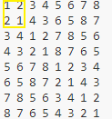
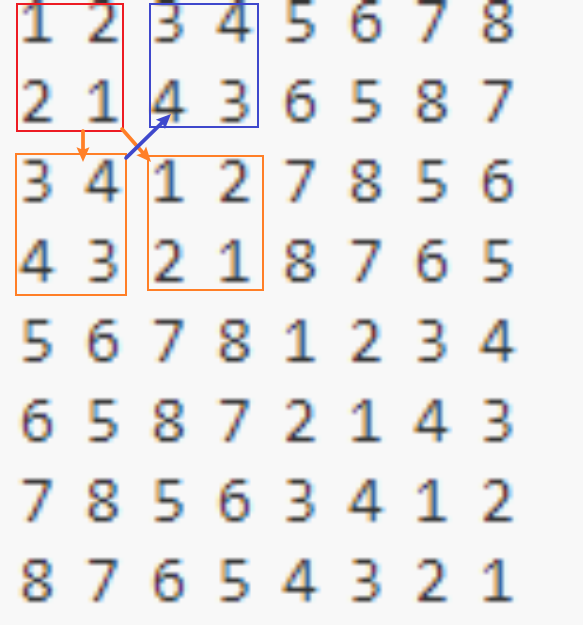
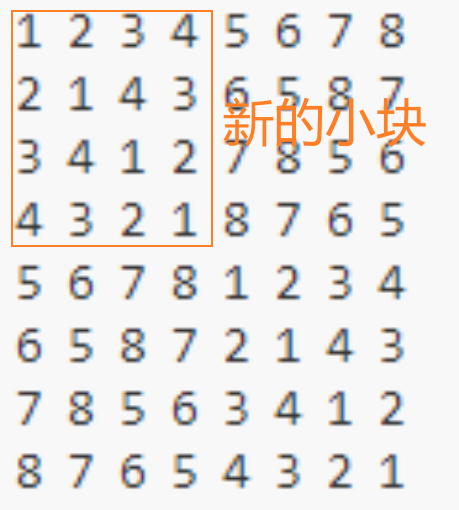

#1.利用分治算法，编程实现循环赛日程表安排问题，并进行时间复杂性分析

```cpp
#include <iostream>
#include <vector>
#include <time.h>
using namespace std;

void schedule(vector<vector<int>> &table, int n, int k) //n为参赛人数,k为log2^n(即2的多少次方为n)
{

    for (int i = 1; i <= n; i++)
    {
        //初始化表格第一行
        table[1][i] = i;
    }

    int m = 1; //控制填充右下=左上，左下=右上的起始位置

    for (int s = 1; s <= k; s++) //s控制的是进行到哪个部分
    {

        n /= 2;

        for (int t = 1; t <= n; t++)
        { //对每一部分进行划分（达到分治目的），从第一部分开始分为n/2个部分，第二个部分则为n/4个部分以此类推进行右下=左上，左下=右上的赋值，t控制的是所在部分的哪一块

            for (int i = 1 + m; i <= 2 * m; i++)
            { //控制将要被赋值的元素所在行

                for (int j = 1 + m; j <= 2 * m; j++)
                { //控制将要被赋值的元素所在列

                    table[i][j + (t - 1) * m * 2] = table[i - m][j + (t - 1) * m * 2 - m]; //右下角等左于上角的值
                    table[i][j + (t - 1) * m * 2 - m] = table[i - m][j + (t - 1) * m * 2]; //左下角等于右上角的值
                }
                //j + (t - 1) * m * 2表示的是右部分的列     j + (t - 1) * m * 2 - m表示的是左部分的列
                //i代表被赋值(将要被拍的部分)所在的行     i-m代表上半部分(已排好的部分)所在的行
            }
        }
        m *= 2;
    }
}

int input(int n, int k) //计算n为2的k次方，并返回k
{

    do
    {
        n = n / 2;
        k++;
    } while (n > 1);

    return k;
}

void display(vector<vector<int>> &table, int n) //输出排好后的日程表
{

    cout << "比赛日程表：" << endl;
    cout << "   ";
    for (int i = 1; i <= n - 1; i++) //输出表头的比赛天数
    {
        if (i != n - 1)
            cout << " " << i;
        else
            cout << " " << i << endl;
    }
    // for (int i = 1; i <= n; i++)
    // {
    //     if (i != n)
    //         cout << "--";
    //     else
    //         cout << "--" << endl;
    // }
    for (int i = 1; i <= n; i++) //输出安排的日程表
    {

        for (int j = 1; j <= n; j++)
        {

            cout << table[i][j] << " ";
            if (j == 1)
                cout << "| ";
        }
        cout << endl;
    }
}

int main()
{
    // clock_t start, finish;
    // //clock_t为CPU时钟计时单元数
    // start = clock();
    // //clock()函数返回此时CPU时钟计时单元数

    int k = 0;
    int n = 0;
    cout << "请输入要比赛的人数: ";
    cin >> n;
    vector<vector<int>> table(n + 1, vector<int>(n + 1)); //创建一个二维数组表示日程表
    k = input(n, k);                                      //2的K次方
    schedule(table, n, k);
    display(table, n);

    // finish = clock();
    // //clock()函数返回此时CPU时钟计时单元数
    // cout << endl
    //      << "the time cost is:" << double(finish - start) / CLOCKS_PER_SEC << endl;
    // //finish与start的差值即为程序运行花费的CPU时钟单元数量，再除每秒CPU有多少个时钟单元，即为程序耗时

    return 0;
}

```
####非递归循环法是先写好第一行，由第1行写出第2行。再由1.2行得出3.4行。再由1.2.3.4行得出5.6.7.8行，并以此类推。


#2.递归法
```cpp
#include <iostream>
using namespace std;
int a[1024][1024];

void schedule_2(int x)
{
    int y = x / 2;
    if (y > 1)
    {
        schedule_2(y);

        for (int i = 0; i < y; i++)
        {
            for (int j = 0; j < y; j++)
            {
                a[i + y][j + y] = a[i][j]; //左上赋给右下
            }
            for (int j = 0; j < y; j++)
            {
                a[i + y][j] = a[i][j] + y; //从左侧头部向下赋值
            }
            for (int j = 0; j < y; j++)
            {
                a[i][j + y] = a[i + y][j]; //左下赋给右上
            }
        }
    }
    else //给初始的左上块赋值
    {
        a[0][0] = 1;
        a[0][1] = 2;
        a[1][0] = 2;
        a[1][1] = 1;
    }
}

int main()
{
    cout << "请输入要比赛的人数: ";
    int n;
    cin >> n;
    schedule_2(n);
    cout << "  ";
    for (int i = 1; i < n; i++)
    {
        cout << i << " ";
    }
    cout << endl;
    for (int i = 0; i < n; i++)
    {
        for (int j = 0; j < n; j++)
        {
            cout << a[i][j] << " ";
        }
        cout << endl;
    }
    return 0;
}
```

####递归法是先定义最左上角的第一个小块

####以这个小块为基准对右下，正下赋值，并由正下给右上赋值。

####此时左上形成了第一个新的小块，继续使用上述算法进行递归运算
